# AVL 与 Splay
这是本课程的第一章内容，主要介绍了 AVL 树与 Splay 树，以及由 Splay 的复杂度分析引出的摊还分析。下面是这三部分内容的介绍。
## 前置知识：旋转
旋转，是一种改变树的形态但不改变二叉搜索树的性质的一种旋转方式，基础旋转操作可分为左旋与右旋。
### 左旋
左旋，就是把一个节点往左儿子方向进行旋转、让右儿子成为新的父节点的操作，原理图为：  
  
??? 参考代码
	```cpp
	tree rotL(tree p){
		tree x=p->rs;
		p->rs=x->ls;
		x->ls=p;
		upd(p);//更新节点信息的函数
		upd(x);
		return x;
	}
	```
### 右旋
右旋，就是把一个节点往右儿子方向进行旋转、让左儿子成为新的父节点的操作，原理图为：  
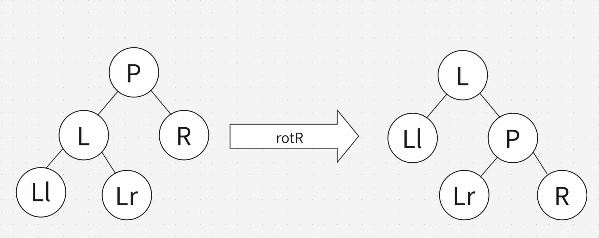  
??? 参考代码
	```cpp
	tree rotR(tree p){
		tree x=p->ls;
		p->ls=x->rs;
		x->rs=p;
		upd(p);
		upd(x);
		return x;
	}
	```
## AVL 树
AVL 树是一种基于高度平衡的一种平衡树，其左右儿子的高度差的绝对值不会超过 $1$（下面记作平衡因子 $\text{HB}(p)$）。基于这一性质，我们可以求出一个高度为 $h$ 的 AVL 树至少包含了多少个节点，以下是计算过程。
??? 计算过程
	设高度为 $h$ 的 AVL 树至少包含 $a_h$ 个节点，则显然有 $a_0=0,a_1=1$。  
	对于更高的 AVL 树，设其高度为 $h$，则其两个儿子的高度最坏情况为一个 $h-1$ 和一个 $h-2$，即 $a_h=a_{h-1}+a_{h-2}+1$。  
	两边同时加一，有 $(a_h+1)=(a_{h-1}+1)+(a_{h-2}+1)$，且 $(a_0+1)=1=\text{Fib}(1),(a_1+1)=2=\text{Fib}(2)$。
	故 $a_h=\text{Fib}(h+1)-1$
由计算过程可知，一个含 $n$ 个节点的 AVL 树，其树高是 $O(\log n)$ 级别的。

接下来将介绍其插入、删除以及其他拓展操作（AVL 树的考点只有插入，介绍其他部分只是为了保持完整性）。先写下其结构体定义，以方便后续理解。  
??? 结构体定义代码
	```cpp
	struct node;
	typedef node* tree;
	struct node{
		int val,h,sz,cnt;
		tree ls,rs;
		node(int val=0,int h=1,int sz=1,int cnt=1,tree ls=0,tree rs=0):val(val),h(h),sz(sz),cnt(cnt),ls(ls),rs(rs){}
	};
	int getH(tree p){
		if(!p)
			return 0;
		return p->h;
	}
	int getHB(tree p){
		if(!p)
			return 0;
		return getH(p->ls)-getH(p->rs);
	}
	int getSize(tree p){
		if(!p)
			return 0;
		return p->sz;
	}
	void upd(tree p){
		if(!p)
			return;
		p->h=max(getH(p->ls),getH(p->rs))+1;
		p->sz=getSize(p->ls)+getSize(p->rs)+p->cnt;
	}
	```

### 插入
插入过程与常规二叉搜索树相同，然而当插入完成后，其性质可能会被破坏（不过尽管如此，$|\text{HB}(p)|\le 2$ 仍然满足），因此需要做出调整，这里存在四种情况。
#### 左左
左儿子的高度更高，且左儿子的左儿子的高度更高，即 $\text{HB}(p)=2,\text{HB}(l)\ge 0$，此时情况如图所示：  
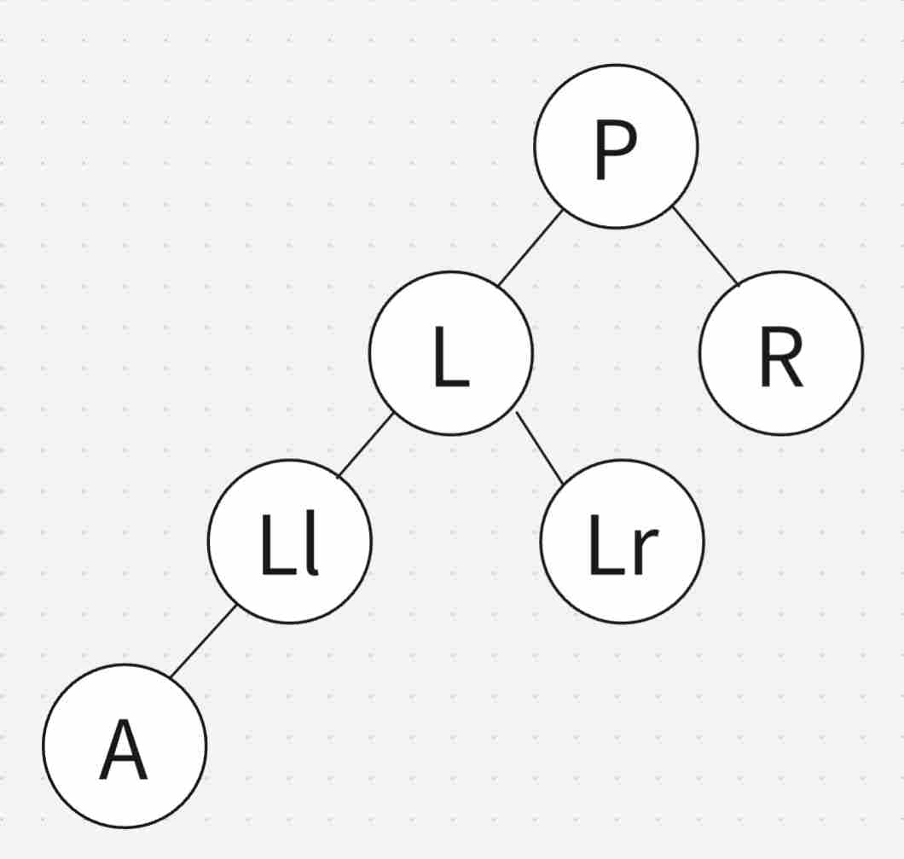  
此时只需要对节点 $p$ 进行右旋，即可再次平衡：  
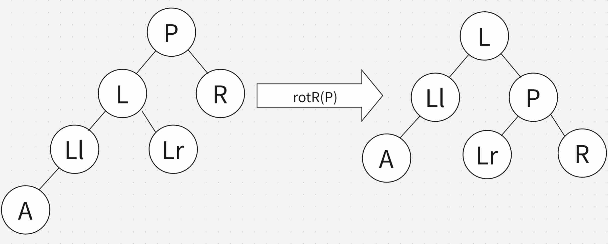
#### 左右
左儿子的高度更高，但左儿子的右儿子的高度更高，即 $\text{HB}(p)=2,\text{HB}(l)<0$，此时情况如图所示：  
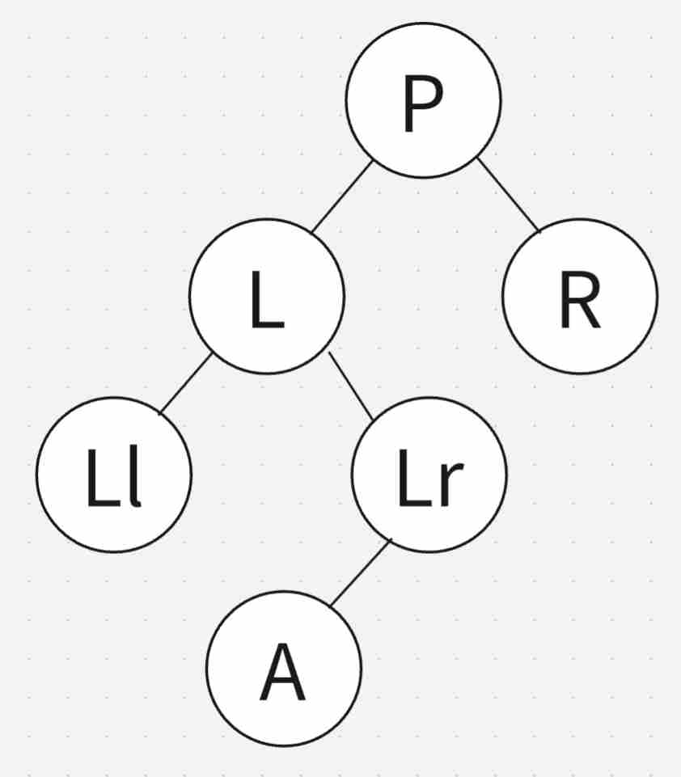  
此时需要对节点 $l$ 进行左旋，以转化为**左左**这一情况：

#### 右右
右儿子的高度更高，且右儿子的右儿子的高度更高，即 $\text{HB}(p)=-2,\text{HB}(l)\le 0$，此时情况如图所示：  
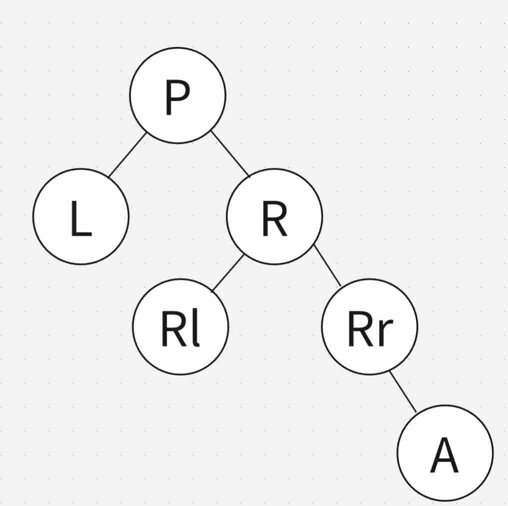  
此时只需要对节点 $p$ 进行左旋，即可再次平衡：  
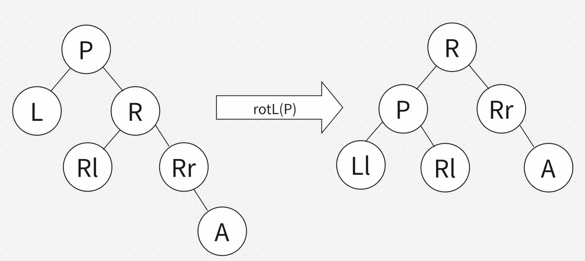
#### 右左
右儿子的高度更高，但右儿子的左儿子的高度更高，即 $\text{HB}(p)=-2,\text{HB}(l)>0$，此时情况如图所示：  
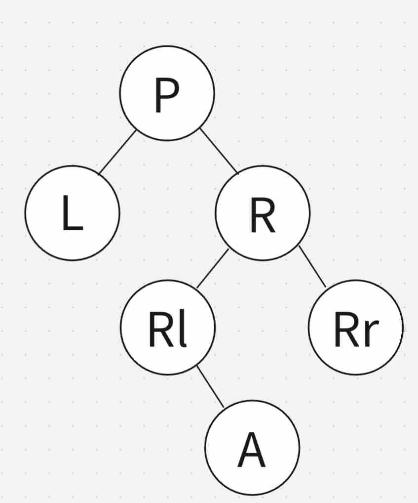  
此时需要对节点 $r$ 进行右旋，以转化为**右右**这一情况：
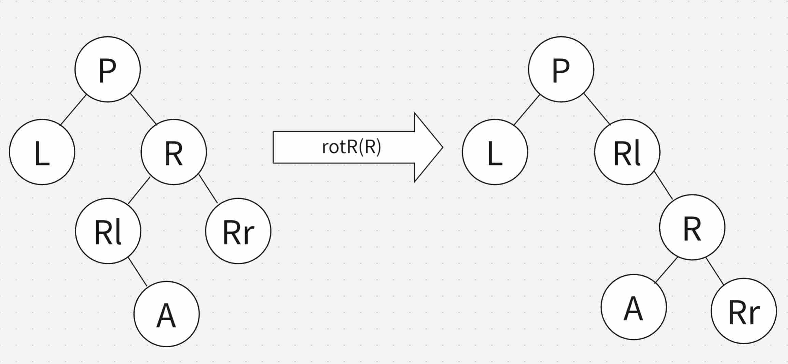

至此，插入产生的四种不平衡情况已介绍完成。  
??? 参考代码
	```cpp
	tree ins(tree p,int x){
		if(!p)
			return new node(x);
		if(x<p->val){
			p->ls=ins(p->ls,x);
			if(getHB(p)>1){
				if(getHB(p->ls)<0)
					p->ls=rotL(p->ls);
				p=rotR(p);
				return p;
			}
		}
		else if(x>p->val){
			p->rs=ins(p->rs,x);
			if(getHB(p)<-1){
				if(getHB(p->rs)>0)
					p->rs=rotR(p->rs);
				p=rotL(p);
				return p;
			}
		}
		else
			++p->cnt;
		upd(p);
		return p;
	}
	```
### 删除
删除过程也与常规二叉搜索树相同，即当儿子数量不为 $2$ 时直接删除，否则找到后继再删除。且删除完成后遇到的情况仍然是上述的四种情况之一，因此这里直接给出参考代码了。!mask[不知道为什么 AVL 树的删除不考，反而考红黑树的删除。]  
??? 参考代码
	```cpp
	tree del(tree p,int x){
		if(!p)
			return p;
		if(x<p->val){
			p->ls=del(p->ls,x);
			if(getHB(p)<-1){
				if(getHB(p->rs)>0)
					p->rs=rotR(p->rs);
				p=rotL(p);
			}
		}
		else if(x>p->val){
			p->rs=del(p->rs,x);
			if(getHB(p)>1){
				if(getHB(p->ls)<0)
					p->ls=rotL(p->ls);
				p=rotR(p);
			}
		}
		else{
			if(p->cnt>1){
				--p->cnt;
				upd(p);
				return p;
			}
			if(!p->ls||!p->rs){
				tree t=p;
				if(!p->ls)
					p=p->rs;
				else
					p=p->ls;
				delete t;
				return p;
			}
			else{
				tree t=p->rs;
				while(t->ls)
					t=t->ls;
				p->val=t->val;
				p->cnt=t->cnt;
				t->cnt=1;
				p->rs=del(p->rs,t->val);
				if(getHB(p)>1){
					if(getHB(p->ls)<0)
						p->ls=rotL(p->ls);
					p=rotR(p);
				}
			}
		}
		upd(p);
		return p;
	}
	```
### 拓展操作
与常规二叉搜索树完全一致。

至此，AVL 树已全部介绍完成，我将给出可以通过洛谷 P3369 的完整代码，有轻度封装。   
??? 参考代码
	```cpp
	#include<bits/stdc++.h>
	using namespace std;
	int read(){
		int x=0,f=1;
		char c=getchar();
		while(!isdigit(c)){
			if(c=='-')
				f=-1;
			c=getchar();
		}
		while(isdigit(c)){
			x=x*10+f*(c-48);
			c=getchar();
		}
		return x;
	}
	struct node;
	typedef node* tree;
	struct node{
		int val,h,sz,cnt;
		tree ls,rs;
		node(int val=0,int h=1,int sz=1,int cnt=1,tree ls=0,tree rs=0):val(val),h(h),sz(sz),cnt(cnt),ls(ls),rs(rs){}
	};
	int getH(tree p){
		if(!p)
			return 0;
		return p->h;
	}
	int getHB(tree p){
		if(!p)
			return 0;
		return getH(p->ls)-getH(p->rs);
	}
	int getSize(tree p){
		if(!p)
			return 0;
		return p->sz;
	}
	void upd(tree p){
		if(!p)
			return;
		p->h=max(getH(p->ls),getH(p->rs))+1;
		p->sz=getSize(p->ls)+getSize(p->rs)+p->cnt;
	}
	tree rotL(tree p){
		tree x=p->rs;
		p->rs=x->ls;
		x->ls=p;
		upd(p);
		upd(x);
		return x;
	}
	tree rotR(tree p){
		tree x=p->ls;
		p->ls=x->rs;
		x->rs=p;
		upd(p);
		upd(x);
		return x;
	}
	tree ins(tree p,int x){
		if(!p)
			return new node(x);
		if(x<p->val){
			p->ls=ins(p->ls,x);
			if(getHB(p)>1){
				if(getHB(p->ls)<0)
					p->ls=rotL(p->ls);
				p=rotR(p);
				return p;
			}
		}
		else if(x>p->val){
			p->rs=ins(p->rs,x);
			if(getHB(p)<-1){
				if(getHB(p->rs)>0)
					p->rs=rotR(p->rs);
				p=rotL(p);
				return p;
			}
		}
		else
			++p->cnt;
		upd(p);
		return p;
	}
	tree del(tree p,int x){
		if(!p)
			return p;
		if(x<p->val){
			p->ls=del(p->ls,x);
			if(getHB(p)<-1){
				if(getHB(p->rs)>0)
					p->rs=rotR(p->rs);
				p=rotL(p);
			}
		}
		else if(x>p->val){
			p->rs=del(p->rs,x);
			if(getHB(p)>1){
				if(getHB(p->ls)<0)
					p->ls=rotL(p->ls);
				p=rotR(p);
			}
		}
		else{
			if(p->cnt>1){
				--p->cnt;
				upd(p);
				return p;
			}
			if(!p->ls||!p->rs){
				tree t=p;
				if(!p->ls)
					p=p->rs;
				else
					p=p->ls;
				delete t;
				return p;
			}
			else{
				tree t=p->rs;
				while(t->ls)
					t=t->ls;
				p->val=t->val;
				p->cnt=t->cnt;
				t->cnt=1;
				p->rs=del(p->rs,t->val);
				if(getHB(p)>1){
					if(getHB(p->ls)<0)
						p->ls=rotL(p->ls);
					p=rotR(p);
				}
			}
		}
		upd(p);
		return p;
	}
	int rnk(tree p,int x){
		if(!p)
			return 1;
		if(x<p->val)
			return rnk(p->ls,x);
		if(x==p->val)
			return getSize(p->ls)+1;
		return getSize(p->ls)+p->cnt+rnk(p->rs,x);
	}
	int val(tree p,int k){
		if(!p||k<=0||k>getSize(p))
			return -1;
		if(k<=getSize(p->ls))
			return val(p->ls,k);
		if(k<=getSize(p->ls)+p->cnt)
			return p->val;
		return val(p->rs,k-getSize(p->ls)-p->cnt);
	}
	int pre(tree p,int x){
		if(!p)
			return -1;
		if(x<=p->val)
			return pre(p->ls,x);
		int t=pre(p->rs,x);
		if(t==-1)
			return p->val;
		return t;
	}
	int suf(tree p,int x){
		if(!p)
			return -1;
		if(x>=p->val)
			return suf(p->rs,x);
		int t=suf(p->ls,x);
		if(t==-1)
			return p->val;
		return t;
	}
	struct AVL{
		tree rt;
		int size(){
			return getSize(rt);
		}
		void insert(int x){
			rt=ins(rt,x);
		}
		void erase(int x){
			rt=del(rt,x);
		}
		int rank(int x){
			return rnk(rt,x);
		}
		int kth(int k){
			return val(rt,k);
		}
		int prev(int x){
			return pre(rt,x);
		}
		int suff(int x){
			return suf(rt,x);
		}
	};
	AVL T;
	int n,opt,x;
	int main(){
		#ifdef alarm5854
		freopen("AVL.in","r",stdin);
		freopen("AVL.out","w",stdout);
		#endif
		n=read();
		for(int i=1;i<=n;++i){
			opt=read();
			x=read();
			if(opt==1)
				T.insert(x);
			else if(opt==2)
				T.erase(x);
			else if(opt==3)
				printf("%d\n",T.rank(x));
			else if(opt==4)
				printf("%d\n",T.kth(x));
			else if(opt==5)
				printf("%d\n",T.prev(x));
			else
				printf("%d\n",T.suff(x));
		}
		return 0;
	}
	```
!mask[这不比OIwiki给出的过度封装且长达904行的代码强多了]
## Splay 树
与 AVL 树不同，Splay 树并不是时刻都试图去保持平衡，这可能导致单次操作的复杂度达到 $O(n)$。然而，由于 Splay 树每次都会把被访问的元素提到根节点，可以证明，通过特殊的旋转方式，使得在连续的 $M$ 次操作中，时间复杂度为 $O((M+n)\log n)$。复杂度的证明将在摊还分析中展开。

Splay 树最核心的部分为伸展，下面将介绍其伸展、插入、删除以及其他拓展操作。
??? 结构体定义代码
	```cpp
	struct node;
	typedef node* tree;
	struct node{
		int val,sz,cnt;
		tree fa,ls,rs;
		node(int val=0,int sz=1,int cnt=1,tree fa=0,tree ls=0,tree rs=0):val(val),sz(sz),cnt(cnt),fa(fa),ls(ls),rs(rs){}
	};
	int getSize(tree p){
		if(!p)
			return 0;
		return p->sz;
	}
	int isleft(tree p){
		if(!p->fa)
			return -1;
		return p->fa->val>p->val;
	}
	void setfa(tree p,tree fa){
		if(!p)
			return;
		p->fa=fa;
		if(!fa)
			return;
		if(isleft(p))
			fa->ls=p;
		else
			fa->rs=p;
	}
	void upd(tree p){
		if(!p)
			return;
		p->sz=getSize(p->ls)+getSize(p->rs)+p->cnt;
		setfa(p->ls,p);
		setfa(p->rs,p);
	}
	tree rotL(tree p){//这里把旋转操作重新放了一遍是因为Splay树的节点需要额外维护fa，以更方便地进行伸展
		tree fa=p->fa;
		tree x=p->rs;
		p->rs=x->ls;
		x->ls=p;
		upd(p);
		upd(x);
		setfa(x,fa);
		return x;
	}
	tree rotR(tree p){
		tree fa=p->fa;
		tree x=p->ls;
		p->ls=x->rs;
		x->rs=p;
		upd(p);
		upd(x);
		setfa(x,fa);
		return x;
	}
	```
### 伸展
伸展是 Splay 树最核心的部分，其要做的是把目标节点旋转至根节点，同时减半路径上大部分节点的高度。对于其旋转方式，可分为三类。
#### zig
这种情况下，$x$ 的父亲 $p$ 就是根节点，根据 $x$ 属于的儿子类型，直接把 $p$ 旋转下去就可以了。
#### zig-zig
令 $p$ 为 $x$ 的父亲，$g$ 为 $p$ 的父亲，若 $x$ 与 $p$ 的属于的儿子类型相同，则该情况为 zig-zig，如下图所示：
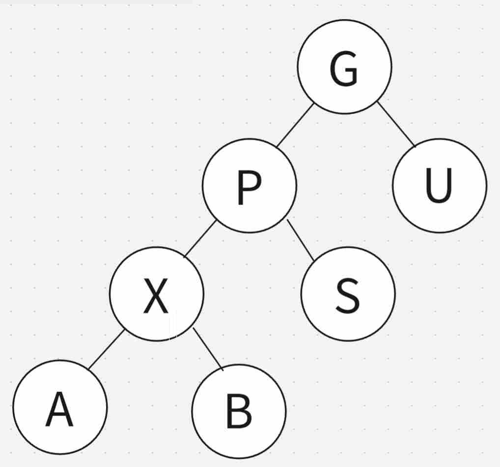
此时，先把 $g$ 旋转下去，再把 $p$ 旋转下去，过程如下：
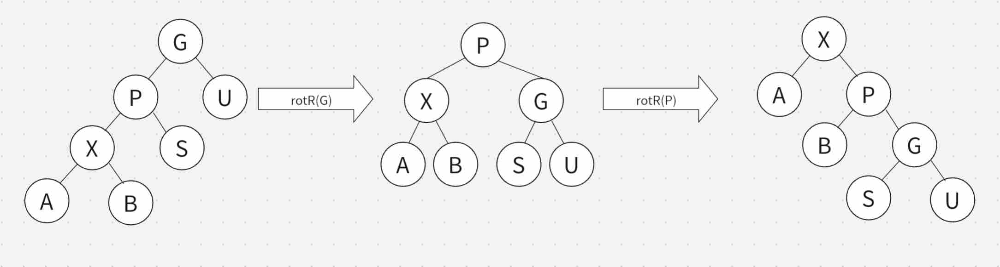
同是右儿子的情况是对称的，这里不再赘述。
#### zig-zag
若 $x$ 与 $p$ 的属于的儿子类型不同，则该情况为 zig-zag，如下图所示：
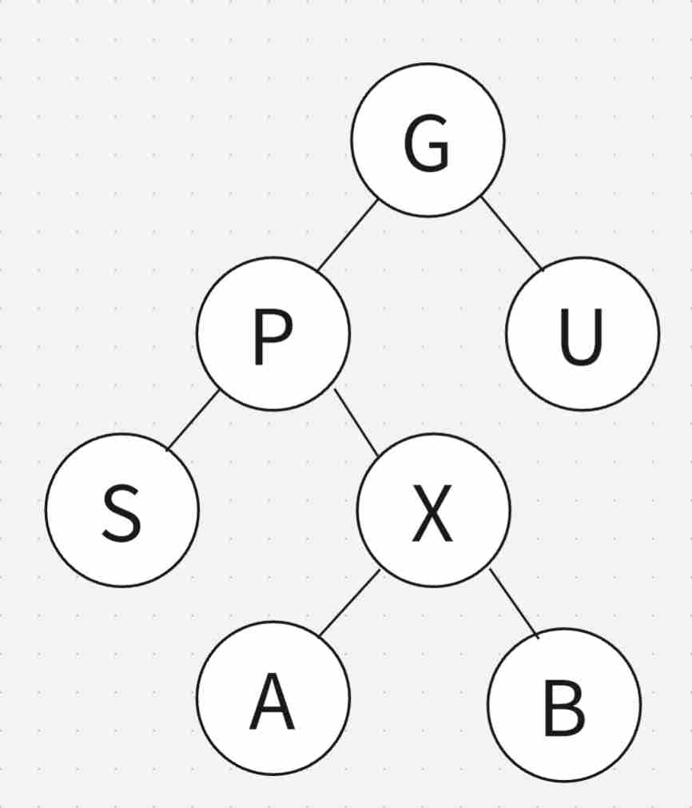
此时，需要先把 $p$ 旋转下去，再把 $g$ 旋转下去，也就是 $x$ 连续向上旋转两次，过程如下：
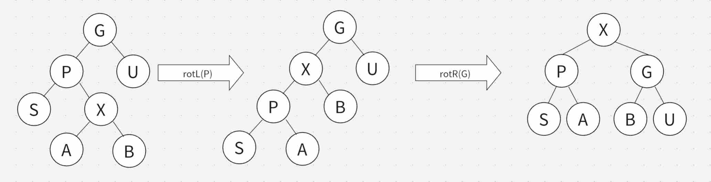
还有一种对称的情况，不再赘述了。

整个旋转过程的代码如下：  
??? 参考代码
	```cpp
	tree rot(tree x){
		tree p=x->fa;
		if(!p){
			return x;
		}
		tree g=p->fa;
		if(!g){
			if(isleft(x))
				return rotR(p);
			else
				return rotL(p);
		}
		if(isleft(p)){
			if(isleft(x)){
				p=rotR(g);
				return rotR(p);
			}
			else{
				x=rotL(p);
				return rotR(g);
			}
		}
		if(isleft(x)){
			x=rotR(p);
			return rotL(g);
		}
		p=rotL(g);
		return rotL(p);
	}
	```
有了旋转的铺垫，伸展操作就简单了，只需要一直向上，直到成为根节点。  
??? 参考代码
	```cpp
	tree splay(tree x){
		if(!x)
			return x;
		while(x->fa)
			x=rot(x);
		return x;
	}
	```
然而，光有指针肯定是不够的，实际上想访问的值可能需要自己去找，并且有时候根本不存在!mask[找的是棍木]，因此还需要一个辅助函数，用于查找某一值，并将最后访问到的节点提至根节点。
??? 参考代码
	```cpp
	tree access(tree p,int x){
		if(!p)
			return p;
		if(x<p->val){
			tree res=access(p->ls,x);
			if(!res)
				return splay(p);
			return res;
		}
		if(x>p->val){
			tree res=access(p->rs,x);
			if(!res)
				return splay(p);
			return res;
		}
		return splay(p);
	}
	```
### 插入
插入过程与常规二叉搜索树相同，只需要在插入完成后，把存有 $x$ 这一值的节点提到根节点即可。
### 删除
删除可以不用像常规二叉搜索树一样麻烦了，只需要先把待删除值提到根节点并删除。此时会分裂为两个二叉搜索树。将左侧二叉搜索树的最大值提到根节点，并让右侧二叉搜索树的根节点成为它的儿子即可。
### 拓展操作
对于查排名、查前驱后继，查之前先进行 access 操作，且对于后两者在找到对应节点后也需要进行 access 操作；对于查 $k$ 大值，则是查之后进行 access 操作。!mask[然而在洛谷P3369中，本人一开始忘记在查 $k$ 大值的时候进行 access 了，但还是过了]

至此，Splay 树已全部介绍完成，我将给出可以通过洛谷 P3369 的完整代码，有轻度封装。
??? 参考代码
	```cpp
	#include<bits/stdc++.h>
	using namespace std;
	int read(){
		int x=0,f=1;
		char c=getchar();
		while(!isdigit(c)){
			if(c=='-')
				f=-1;
			c=getchar();
		}
		while(isdigit(c)){
			x=x*10+f*(c-48);
			c=getchar();
		}
		return x;
	}
	struct node;
	typedef node* tree;
	struct node{
		int val,sz,cnt;
		tree fa,ls,rs;
		node(int val=0,int sz=1,int cnt=1,tree fa=0,tree ls=0,tree rs=0):val(val),sz(sz),cnt(cnt),fa(fa),ls(ls),rs(rs){}
	};
	int getSize(tree p){
		if(!p)
			return 0;
		return p->sz;
	}
	int isleft(tree p){
		if(!p->fa)
			return -1;
		return p->fa->val>p->val;
	}
	void setfa(tree p,tree fa){
		if(!p)
			return;
		p->fa=fa;
		if(!fa)
			return;
		if(isleft(p))
			fa->ls=p;
		else
			fa->rs=p;
	}
	void upd(tree p){
		if(!p)
			return;
		p->sz=getSize(p->ls)+getSize(p->rs)+p->cnt;
		setfa(p->ls,p);
		setfa(p->rs,p);
	}
	tree rotL(tree p){
		tree fa=p->fa;
		tree x=p->rs;
		p->rs=x->ls;
		x->ls=p;
		upd(p);
		upd(x);
		setfa(x,fa);
		return x;
	}
	tree rotR(tree p){
		tree fa=p->fa;
		tree x=p->ls;
		p->ls=x->rs;
		x->rs=p;
		upd(p);
		upd(x);
		setfa(x,fa);
		return x;
	}
	tree rot(tree x){
		tree p=x->fa;
		if(!p){
			return x;
		}
		tree g=p->fa;
		if(!g){
			if(isleft(x))
				return rotR(p);
			else
				return rotL(p);
		}
		if(isleft(p)){
			if(isleft(x)){
				p=rotR(g);
				return rotR(p);
			}
			else{
				x=rotL(p);
				return rotR(g);
			}
		}
		if(isleft(x)){
			x=rotR(p);
			return rotL(g);
		}
		p=rotL(g);
		return rotL(p);
	}
	tree splay(tree x){
		if(!x)
			return x;
		while(x->fa)
			x=rot(x);
		return x;
	}
	tree access(tree p,int x){
		if(!p)
			return p;
		if(x<p->val){
			tree res=access(p->ls,x);
			if(!res)
				return splay(p);
			return res;
		}
		if(x>p->val){
			tree res=access(p->rs,x);
			if(!res)
				return splay(p);
			return res;
		}
		return splay(p);
	}
	tree ins(tree p,int x){
		if(!p)
			return new node(x);
		if(x<p->val)
			p->ls=ins(p->ls,x);
		else if(x>p->val)
			p->rs=ins(p->rs,x);
		else
			++p->cnt;
		upd(p);
		return p;
	}
	int rnk(tree p,int x){
		if(!p)
			return 1;
		if(x<p->val)
			return rnk(p->ls,x);
		if(x==p->val)
			return getSize(p->ls)+1;
		return getSize(p->ls)+p->cnt+rnk(p->rs,x);
	}
	int val(tree p,int k){
		if(!p||k<=0||k>getSize(p))
			return -1;
		if(k<=getSize(p->ls))
			return val(p->ls,k);
		if(k<=getSize(p->ls)+p->cnt)
			return p->val;
		return val(p->rs,k-getSize(p->ls)-p->cnt);
	}
	int pre(tree p,int x){
		if(!p)
			return -1;
		if(x<=p->val)
			return pre(p->ls,x);
		int t=pre(p->rs,x);
		if(t==-1)
			return p->val;
		return t;
	}
	int suf(tree p,int x){
		if(!p)
			return -1;
		if(x>=p->val)
			return suf(p->rs,x);
		int t=suf(p->ls,x);
		if(t==-1)
			return p->val;
		return t;
	}
	struct Splay{
		tree rt;
		int size(){
			return getSize(rt);
		}
		void insert(int x){
			rt=ins(rt,x);
			rt=access(rt,x);
		}
		void erase(int x){
			rt=access(rt,x);
			if(!rt||rt->val!=x)
				return;
			if(rt->cnt>1){
				--rt->cnt;
				upd(rt);
				return;
			}
			if(!rt->ls){
				tree t=rt;
				rt=rt->rs;
				setfa(rt,0);
				delete t;
			}
			else{
				tree t=rt,p=rt->ls;
				while(p->rs)
					p=p->rs;
				setfa(t->ls,0);
				rt=access(t->ls,p->val);
				setfa(t->rs,rt);
				delete t;
				upd(rt);
			}
		}
		int rank(int x){
			rt=access(rt,x);
			if(!rt)
				return 1;
			return rnk(rt,x);
		}
		int kth(int k){
			int res=val(rt,k);
			if(res!=-1)
				rt=access(rt,res);
			return res;
		}
		int prev(int x){
			rt=access(rt,x);
			if(!rt)
				return -1;
			int res=pre(rt,x);
			rt=access(rt,res);
			return res;
		}
		int suff(int x){
			rt=access(rt,x);
			if(!rt)
				return -1;
			int res=suf(rt,x);
			rt=access(rt,res);
			return res;
		}
	};
	Splay T;
	int n,opt,x;
	int main(){
		#ifdef alarm5854
		freopen("splay.in","r",stdin);
		freopen("splay.out","w",stdout);
		#endif
		n=read();
		for(int i=1;i<=n;++i){
			opt=read();
			x=read();
			if(opt==1)
				T.insert(x);
			else if(opt==2)
				T.erase(x);
			else if(opt==3)
				printf("%d\n",T.rank(x));
			else if(opt==4)
				printf("%d\n",T.kth(x));
			else if(opt==5)
				printf("%d\n",T.prev(x));
			else
				printf("%d\n",T.suff(x));
		}
		return 0;
	}
	```
## 摊还分析
有些算法的单次最坏复杂度可能很高，但并不是每次都这样。为了更准确地分析复杂度，这里引入了摊还分析。

摊还分析分为聚合法、记账法、势能法这三种，下面介绍的是势能法。

### push,pop,multipop
对于 push,pop,multipop 这三种操作，由于 multipop 这一操作的单次复杂度可能达到 $O(n)$，故需要摊还分析。

定义 $\Phi_1(x)$ 为完成第 $x$ 步后一共操作的次数，$\Phi_2(x)$ 为完成第 $x$ 步后栈中元素个数，显然 $0\le \Phi_2(x)\le n$，初始 $\Phi_1(0)=\Phi_2(0)=0$，则对于第 $i$ 个操作：  

- 若为 push 操作，则 $\Phi_1(i)-\Phi_1(i-1)=1,\Phi_2(i)-\Phi_2(i-1)=1$
- 若为 pop 操作，则 $\Phi_1(i)-\Phi_1(i-1)=1,\Phi_2(i)-\Phi_2(i-1)=-1$
- 若为 multipop 操作，则 $\Phi_1(i)-\Phi_1(i-1)=k,\Phi_2(i)-\Phi_2(i-1)=-k$

则 $\Phi_1(n)+\Phi_2(n)\le 2n$，故 $\Phi_1(n)\le 3n$，证明了时间复杂度为 $O(n)$。
### splay 树
定义 $\Phi_1(x)$ 为完成第 $x$ 步后一共旋转的次数，$\Phi_2(x)$ 为完成第 $x$ 步后 $\sum_{u\in \text{Tree}} \text{rank}_u$ 的值，其中 $\text{rank}_x=\log(\text{size}_x)$，显然 $0\le \Phi_2(x)\le n\log n$，初始 $\Phi_1(0)=\Phi_2(0)=0$。

对于每次操作，都可以证明：

$$(\Phi_1(i)-\Phi_1(i-1))+(\Phi_2(i)-\Phi_2(i-1))\le 3(\text{rank}'_x-\text{rank}_x)+1\le 3\log n+1$$

具体证明过程为对三种旋转情况分别进行分类讨论，需要适当放缩。

则 $\Phi_1(M)+\Phi_2(M)\le 3M\log n+M$，即复杂度为 $O((M+n)\log n)$。
## 错题集
??? 错题1
	
	注意定语为 most nodes in the tree，应该改为 most nodes in the path