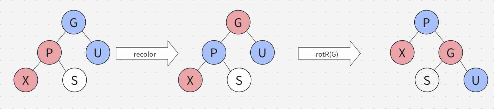
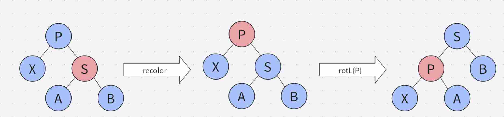
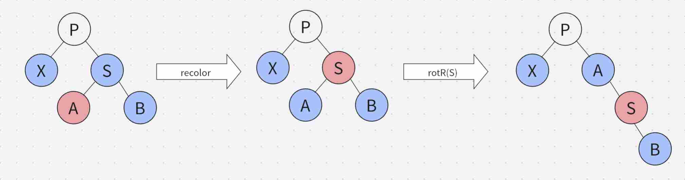
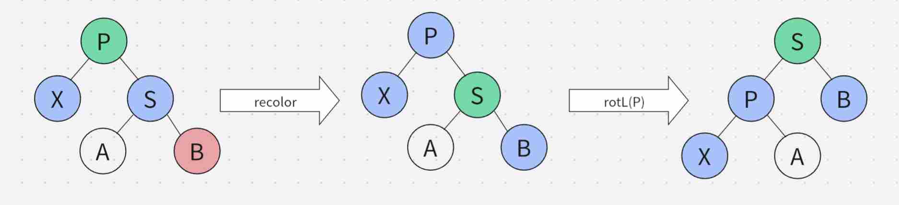
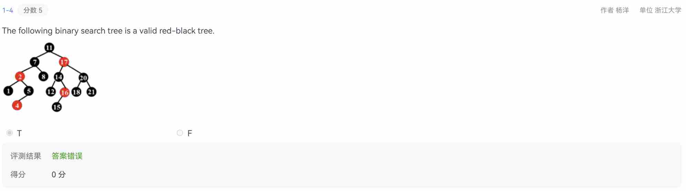

# 红黑树与 B+ 树
这是本课程的第二章内容，主要介绍了红黑树与 B+ 树，相比于前两种平衡树，实现难度更大。!mask[代码也更加难懂]
## 红黑树
红黑树是每个结点都带有颜色属性的二叉查找树，颜色或红色或黑色。其需要满足以下五个要求：

- 节点是红色或黑色
- 根节点是黑色
- 所有叶子节点都是黑色（NIL 节点）
- 每个红色节点的两个儿子全都是黑色
- 从任一结点到其每个叶子的所有路径都包含相同数目的黑色结点

这些约束强制了红黑树的关键性质: 从根到叶子的最长的可能路径不多于最短的可能路径的两倍长。因此，一个有 $n$ 个节点的红黑树，其高度是 $O(\log n)$ 的。

下面将介绍其伸展、插入、删除以及其他拓展操作。（主要是插入和删除的调整）。
??? 结构体定义代码
	```cpp
	struct node;
	typedef node* tree;
	struct node{
		int val,color,sz,cnt;
		tree ls,rs,fa;
		node(int val=0,int color=1,int sz=1,int cnt=1,tree ls=0,tree rs=0,tree fa=0):val(val),color(color),sz(sz),cnt(cnt),ls(ls),rs(rs),fa(fa){}
	};
	int getColor(tree p){
		if(!p)
			return 0;
		return p->color;
	}
	int getSize(tree p){
		if(!p)
			return 0;
		return p->sz;
	}
	int isLeft(tree p){
		if(!p||!p->fa)
			return 0;
		return p->fa->val>p->val;
	}
	void setfa(tree p,tree fa){
		if(!p)
			return;
		p->fa=fa;
		if(!fa)
			return;
		if(isLeft(p))
			fa->ls=p;
		else
			fa->rs=p;
	}
	tree sibling(tree p){
		if(!p||!p->fa)
			return 0;
		if(isLeft(p))
			return p->fa->rs;
		return p->fa->ls;
	}
	tree uncle(tree p){
		if(!p||!p->fa)
			return 0;
		return sibling(p->fa);
	}
	void upd(tree p){
		if(!p)
			return;
		p->sz=getSize(p->ls)+getSize(p->rs)+p->cnt;
		setfa(p->ls,p);
		setfa(p->rs,p);
	}
	//旋转部分与 Splay 一致
	```
### 插入
插入过程与常规二叉搜索树相同，然而当插入完成后，其性质可能会被破坏，因此需要做出调整（red-red conflict），这里存在四种情况。为方便叙述，设**调整**节点为 $x$，其父节点为 $p$，其祖父节点为 $g$，$g$ 的另一个儿子为 $u$(uncle)。
??? info
	除了根节点与重复节点，其余情况下插入的点一定是红点

- Case 0：$p$ 是棍木或 $g$ 是棍木
- Case 1：$u$ 是红叔
- Case 2：$x$ 与 $p$ 异侧
- Case 3：$x$ 与 $p$ 同侧

#### Case 0
此时 $x$ 是根或 $p$ 是根，直接把根染黑即可。
#### Case 1
此时把 $p$ 和 $u$ 一起染黑，把 $g$ 染红，然后调整 $g$ 即可。
#### Case 2
此时把 $p$ 转下去，把带调整节点改为 $p$，此时 $p$ 与 $x$ 同侧，为 Case 3。
#### Case 3
此时需要先把 $p$ 染黑，把 $g$ 染红，然后再把 $g$ 往反方向转下去（也就是把 $p$ 转上来），示意图如下：


至此，插入调整已介绍完成，以下是插入与插入调整的代码：
??? 参考代码
	```cpp
	tree insertFix(tree x){
		tree p=x->fa;
		if(!p){
			x->color=0;
			return x;
		}
		if(p->color==0)
			return x;
		tree g=p->fa;
		if(!g){
			p->color=0;
			return p;
		}
		tree u=uncle(x);
		if(getColor(u)==1){
			p->color=0;
			u->color=0;
			g->color=1;
			upd(p);
			upd(g);
			return insertFix(g);
		}
		if(isLeft(p)){
			if(isLeft(x)){
				p->color=0;
				g->color=1;
				return rotR(g);
			}
			else{
				x=rotL(p);
				x->color=0;
				g->color=1;
				return rotR(g);
			}
		}
		else{
			if(!isLeft(x)){
				p->color=0;
				g->color=1;
				return rotL(g);
			}
			else{
				x=rotR(p);
				x->color=0;
				g->color=1;
				return rotL(g);
			}
		}
	}
	tree ins(tree root,int val){
		if(!root)
			return new node(val,0);
		tree p=root,fa=0;
		while(p){
			fa=p;
			if(p->val==val){
				p->cnt++;
				while(p){
					upd(p);
					p=p->fa;
				}
				return root;
			}
			if(p->val>val)
				p=p->ls;
			else
				p=p->rs;
		}
		p=new node(val);
		setfa(p,fa);
		upd(fa);
		tree cur=insertFix(p);
		while(cur->fa){
			cur=cur->fa;
			upd(cur);
		}
		return cur;
	}
	```
### 删除
删除过程也与常规二叉搜索树相同，即当儿子数量不为 $2$ 时直接删除，否则找到后继再删除。删除完成后，会存在五种情况。为方便叙述，设**调整**节点为 $x$，其父节点为 $p$，其兄弟为 $s$。

- Case 0：删除的点是红点（若存在一个儿子，则一定是这种情况）
- Case 1：$s$ 是红点
- Case 2：$s$ 的两个儿子全是黑点
- Case 3: $s$ 的同侧儿子是黑点
- Case 4: $s$ 的同侧儿子是红点

??? warning
	注意在删除的过程中，应当先记住待删除节点的位置，并以该位置进行调整。调整完成后，再把该位置的节点删去。

#### Case 0
无需调整。
#### Case 1
此时需要把 $s$ 染黑，把 $p$ 染红，然后把 $p$ 往 $x$ 的方向旋下去，此时问题转化为后三种情况，示意图如下：

#### Case 2
这种情况下，先把 $s$ 染红。若 $p$ 是红色，则把 $p$ 染黑即可完成，否则递归至调整 $p$ 的情况。
#### Case 3
这种情况下，先把 $s$ 染红，把 $s$ 的异侧儿子染黑，再把 $s$ 往同侧儿子的方向旋下去，则转化为 Case 4，示意图如下：

#### Case 4
这种情况下，先把 $s$ 染成 $p$ 的颜色，把 $p$ 和 $s$ 的同侧儿子染黑，再把 $p$ 往 $x$ 的方向旋下去即完成调整，示意图如下：


至此，删除调整已介绍完成，以下是删除与删除调整的代码：
??? 参考代码
	```cpp
	void delFix(tree x){
		tree p=x->fa;
		if(!p)
			return;
		tree s=sibling(x);
		if(getColor(s)==1){
			p->color=1;
			s->color=0;
			if(isLeft(x))
				rotL(p);
			else
				rotR(p);
			delFix(x);
			return;
		}
		if(getColor(p)==0&&(getColor(s->ls)==0&&getColor(s->rs)==0)){
			s->color=1;
			delFix(p);
			return;
		}
		if(getColor(p)==1&&(getColor(s->ls)==0&&getColor(s->rs)==0)){
			s->color=1;
			p->color=0;
			return;
		}
		if(isLeft(x)&&getColor(s->rs)==0){
			s->color=1;
			s->ls->color=0;
			rotR(s);
			delFix(x);
			return;
		}
		if(!isLeft(x)&&getColor(s->ls)==0){
			s->color=1;
			s->rs->color=0;
			rotL(s);
			delFix(x);
			return;
		}
		if(isLeft(x)){
			s->color=p->color;
			p->color=0;
			s->rs->color=0;
			rotL(p);
		}
		else{
			s->color=p->color;
			p->color=0;
			s->ls->color=0;
			rotR(p);
		}
	}
	tree del(tree root,int val){
		tree p=root;
		while(p){
			if(p->val==val)
				break;
			if(p->val>val)
				p=p->ls;
			else
				p=p->rs;
		}
		if(!p)
			return root;
		if(p->cnt>1){
			p->cnt--;
			while(p){
				upd(p);
				p=p->fa;
			}
			return root;
		}
		if(p->ls&&p->rs){
			tree nxt=p->rs;
			while(nxt->ls)
				nxt=nxt->ls;
			p->val=nxt->val;
			p->cnt=nxt->cnt;
			nxt->cnt=1;
			p=nxt;
		}
		tree fa=p->fa;
		tree child=p->ls?p->ls:p->rs;
		if(getColor(p)==0){
			if(getColor(child)==1){
				child->color=0;
				setfa(child,fa);
			}
			else{
				setfa(child,fa);
				delFix(p);
			}
		}
		else
			setfa(child,fa);
		tree cur=p->fa;
		if(!cur){
			delete p;
			return child;
		}
		if(isLeft(p))
			cur->ls=child;
		else
			cur->rs=child;
		delete p;
		while(cur->fa){
			upd(cur);
			cur=cur->fa;
		}
		upd(cur);
		return cur;
	}
	```
### 拓展操作
与常规二叉搜索树完全一致。

至此，红黑树已全部介绍完成，我将给出可以通过洛谷 P3369 的完整代码，有轻度封装。   
??? 参考代码
	```cpp
	#include<bits/stdc++.h>
	using namespace std;
	int read(){
		int x=0,f=1;
		char c=getchar();
		while(!isdigit(c)){
			if(c=='-')
				f=-1;
			c=getchar();
		}
		while(isdigit(c)){
			x=x*10+f*(c-48);
			c=getchar();
		}
		return x;
	}
	struct node;
	typedef node* tree;
	struct node{
		int val,color,sz,cnt;
		tree ls,rs,fa;
		node(int val=0,int color=1,int sz=1,int cnt=1,tree ls=0,tree rs=0,tree fa=0):val(val),color(color),sz(sz),cnt(cnt),ls(ls),rs(rs),fa(fa){}
	};
	int getColor(tree p){
		if(!p)
			return 0;
		return p->color;
	}
	int getSize(tree p){
		if(!p)
			return 0;
		return p->sz;
	}
	int isLeft(tree p){
		if(!p||!p->fa)
			return 0;
		return p->fa->val>p->val;
	}
	void setfa(tree p,tree fa){
		if(!p)
			return;
		p->fa=fa;
		if(!fa)
			return;
		if(isLeft(p))
			fa->ls=p;
		else
			fa->rs=p;
	}
	tree sibling(tree p){
		if(!p||!p->fa)
			return 0;
		if(isLeft(p))
			return p->fa->rs;
		return p->fa->ls;
	}
	tree uncle(tree p){
		if(!p||!p->fa)
			return 0;
		return sibling(p->fa);
	}
	void upd(tree p){
		if(!p)
			return;
		p->sz=getSize(p->ls)+getSize(p->rs)+p->cnt;
		setfa(p->ls,p);
		setfa(p->rs,p);
	}
	tree rotL(tree p){
		tree fa=p->fa;
		tree x=p->rs;
		p->rs=x->ls;
		x->ls=p;
		upd(p);
		upd(x);
		setfa(x,fa);
		return x;
	}
	tree rotR(tree p){
		tree fa=p->fa;
		tree x=p->ls;
		p->ls=x->rs;
		x->rs=p;
		upd(p);
		upd(x);
		setfa(x,fa);
		return x;
	}
	tree insertFix(tree x){
		tree p=x->fa;
		if(!p){
			x->color=0;
			return x;
		}
		if(p->color==0)
			return x;
		tree g=p->fa;
		if(!g){
			p->color=0;
			return p;
		}
		tree u=uncle(x);
		if(getColor(u)==1){
			p->color=0;
			u->color=0;
			g->color=1;
			upd(p);
			upd(g);
			return insertFix(g);
		}
		if(isLeft(p)){
			if(isLeft(x)){
				p->color=0;
				g->color=1;
				return rotR(g);
			}
			else{
				x=rotL(p);
				x->color=0;
				g->color=1;
				return rotR(g);
			}
		}
		else{
			if(!isLeft(x)){
				p->color=0;
				g->color=1;
				return rotL(g);
			}
			else{
				x=rotR(p);
				x->color=0;
				g->color=1;
				return rotL(g);
			}
		}
	}
	tree ins(tree root,int val){
		if(!root)
			return new node(val,0);
		tree p=root,fa=0;
		while(p){
			fa=p;
			if(p->val==val){
				p->cnt++;
				while(p){
					upd(p);
					p=p->fa;
				}
				return root;
			}
			if(p->val>val)
				p=p->ls;
			else
				p=p->rs;
		}
		p=new node(val);
		setfa(p,fa);
		upd(fa);
		tree cur=insertFix(p);
		while(cur->fa){
			cur=cur->fa;
			upd(cur);
		}
		return cur;
	}
	void delFix(tree x){
		tree p=x->fa;
		if(!p)
			return;
		tree s=sibling(x);
		if(getColor(s)==1){
			p->color=1;
			s->color=0;
			if(isLeft(x))
				rotL(p);
			else
				rotR(p);
			delFix(x);
			return;
		}
		if(getColor(p)==0&&(getColor(s->ls)==0&&getColor(s->rs)==0)){
			s->color=1;
			delFix(p);
			return;
		}
		if(getColor(p)==1&&(getColor(s->ls)==0&&getColor(s->rs)==0)){
			s->color=1;
			p->color=0;
			return;
		}
		if(isLeft(x)&&getColor(s->rs)==0){
			s->color=1;
			s->ls->color=0;
			rotR(s);
			delFix(x);
			return;
		}
		if(!isLeft(x)&&getColor(s->ls)==0){
			s->color=1;
			s->rs->color=0;
			rotL(s);
			delFix(x);
			return;
		}
		if(isLeft(x)){
			s->color=p->color;
			p->color=0;
			s->rs->color=0;
			rotL(p);
		}
		else{
			s->color=p->color;
			p->color=0;
			s->ls->color=0;
			rotR(p);
		}
	}
	tree del(tree root,int val){
		tree p=root;
		while(p){
			if(p->val==val)
				break;
			if(p->val>val)
				p=p->ls;
			else
				p=p->rs;
		}
		if(!p)
			return root;
		if(p->cnt>1){
			p->cnt--;
			while(p){
				upd(p);
				p=p->fa;
			}
			return root;
		}
		if(p->ls&&p->rs){
			tree nxt=p->rs;
			while(nxt->ls)
				nxt=nxt->ls;
			p->val=nxt->val;
			p->cnt=nxt->cnt;
			nxt->cnt=1;
			p=nxt;
		}
		tree fa=p->fa;
		tree child=p->ls?p->ls:p->rs;
		if(getColor(p)==0){
			if(getColor(child)==1){
				child->color=0;
				setfa(child,fa);
			}
			else{
				setfa(child,fa);
				delFix(p);
			}
		}
		else
			setfa(child,fa);
		tree cur=p->fa;
		if(!cur){
			delete p;
			return child;
		}
		if(isLeft(p))
			cur->ls=child;
		else
			cur->rs=child;
		delete p;
		while(cur->fa){
			upd(cur);
			cur=cur->fa;
		}
		upd(cur);
		return cur;
	}
	int rnk(tree p,int x){
		if(!p)
			return 1;
		if(x<p->val)
			return rnk(p->ls,x);
		if(x>p->val)
			return getSize(p->ls)+p->cnt+rnk(p->rs,x);
		return getSize(p->ls)+1;
	}
	int val(tree p,int k){
		if(!p||k<=0||k>getSize(p))
			return -1;
		if(k<=getSize(p->ls))
			return val(p->ls,k);
		if(k<=getSize(p->ls)+p->cnt)
			return p->val;
		return val(p->rs,k-getSize(p->ls)-p->cnt);
	}
	int pre(tree p,int x){
		if(!p)
			return -1;
		if(x<=p->val)
			return pre(p->ls,x);
		int t=pre(p->rs,x);
		if(t==-1)
			return p->val;
		return t;
	}
	int suf(tree p,int x){
		if(!p)
			return -1;
		if(x>=p->val)
			return suf(p->rs,x);
		int t=suf(p->ls,x);
		if(t==-1)
			return p->val;
		return t;
	}
	struct RBtree{
		tree rt;
		int size(){
			return getSize(rt);
		}
		void insert(int x){
			rt=ins(rt,x);
		}
		void erase(int x){
			rt=del(rt,x);
		}
		int rank(int x){
			return rnk(rt,x);
		}
		int kth(int k){
			return val(rt,k);
		}
		int prev(int x){
			return pre(rt,x);
		}
		int suff(int x){
			return suf(rt,x);
		}
	};
	RBtree T;
	int n,opt,x;
	int main(){
		#ifdef alarm5854
		freopen("RBtree.in","r",stdin);
		freopen("RBtree.out","w",stdout);
		#endif
		n=read();
		for(int i=1;i<=n;++i){
			opt=read();
			x=read();
			if(opt==1)
				T.insert(x);
			else if(opt==2)
				T.erase(x);
			else if(opt==3)
				printf("%d\n",T.rank(x));
			else if(opt==4)
				printf("%d\n",T.kth(x));
			else if(opt==5)
				printf("%d\n",T.prev(x));
			else
				printf("%d\n",T.suff(x));
		}
		return 0;
	}
	```
## B+ 树
B+ 树与其他平衡树并不相同，其所有值均存储在叶子结点中，非叶子节点的值仅作为索引。B+ 树满足以下条件：

- 根节点要么是叶子，要么有 $2\sim \text{ord}$ 个儿子
- 所有非根节点均有 $\lceil \text{ord}/2\rceil\sim \text{ord}$ 个儿子（对于叶子则是存储这么多值）
- 所有叶子节点深度相同

这些定义使得其和常规的平衡树有很大的区别，以下是其结构体定义的代码：

??? 参考代码
	```cpp
	struct node;
	typedef node* tree;
	struct node{
		int isleaf,isroot,sz,cntch;
		int keys[ord+1],cnt[ord+1];
		tree fa,ch[ord+1];
		node(int isleaf=1,int isroot=1,int sz=0,int cntch=0,tree fa=0):isleaf(isleaf),isroot(isroot),sz(sz),cntch(cntch),fa(fa){
			memset(keys,0,sizeof(keys));
			memset(cnt,0,sizeof(cnt));
			memset(ch,0,sizeof(ch));
		}
	};
	int getSize(tree p){
		if(!p)
			return 0;
		return p->sz;
	}
	void upd(tree p){
		if(!p)
			return;
		p->sz=0;
		if(p->isleaf){
			for(int i=0;i<p->cntch;++i)
				p->sz+=p->cnt[i];
		}
		else{
			for(int i=0;i<p->cntch;++i){
				p->sz+=getSize(p->ch[i]);
				p->ch[i]->fa=p;
				p->keys[i]=p->ch[i]->keys[0];
			}
		}
	}
	```
### 插入
先根据索引值（在本文中，索引值表示的是在该子树内节点大小的最小值）定位到插入的位置，插入完成后可能会发生儿子数量过多的问题。此时需要进行分裂，分裂分为两种情况：

- 若分裂的是根节点，则新建一个含有两个儿子的根节点，并把原根节点分裂成两半
- 若分裂的是非根节点，则分裂完成后还需要往父节点插入一个新的索引，这可能导致父节点需要进一步分裂

过程还是相当容易理解的，以下是插入的参考代码。!mask[写起来是相当坐牢的]
??? 参考代码
	```cpp
	void split(tree p){
		int mid=p->cntch/2;
		tree fa=p->fa;
		p->isroot=0;
		tree np=new node(p->isleaf,0);
		if(p->isleaf){
			for(int i=mid;i<p->cntch;++i){
				np->keys[np->cntch]=p->keys[i];
				np->cnt[np->cntch]=p->cnt[i];
				p->keys[i]=0;
				p->cnt[i]=0;
				++np->cntch;
			}
			p->cntch=mid;
			upd(p);
			upd(np);
			if(!fa){
				fa=new node(0,1,0);
				p->fa=fa;
				np->fa=fa;
				fa->ch[fa->cntch]=p;
				fa->keys[fa->cntch]=p->keys[0];
				++fa->cntch;
				fa->ch[fa->cntch]=np;
				fa->keys[fa->cntch]=np->keys[0];
				++fa->cntch;
				upd(fa);
				return;
			}
			int pos=0;
			while(pos<fa->cntch&&fa->keys[pos]<np->keys[0])
				++pos;
			for(int i=fa->cntch;i>pos;--i){
				fa->ch[i]=fa->ch[i-1];
				fa->keys[i]=fa->keys[i-1];
			}
			np->fa=fa;
			fa->ch[pos]=np;
			fa->keys[pos]=np->keys[0];
			++fa->cntch;
			upd(fa);
			if(fa->cntch>ord)
				split(fa);
			return;
		}
		else{
			for(int i=mid;i<p->cntch;++i){
				np->keys[np->cntch]=p->keys[i];
				np->ch[np->cntch]=p->ch[i];
				p->ch[i]->fa=np;
				++np->cntch;
			}
			int x=p->keys[0],y=p->keys[mid];
			p->cntch=mid;
			upd(p);
			upd(np);
			if(!fa){
				fa=new node(0,1,0);
				p->fa=fa;
				np->fa=fa;
				fa->ch[fa->cntch]=p;
				fa->keys[fa->cntch]=x;
				++fa->cntch;
				fa->ch[fa->cntch]=np;
				fa->keys[fa->cntch]=y;
				++fa->cntch;
				upd(fa);
				return;
			}
			int pos=0;
			while(pos<fa->cntch&&fa->keys[pos]<y)
				++pos;
			for(int i=fa->cntch;i>pos;--i){
				fa->ch[i]=fa->ch[i-1];
				fa->keys[i]=fa->keys[i-1];
			}
			np->fa=fa;
			fa->ch[pos]=np;
			fa->keys[pos]=y;
			++fa->cntch;
			upd(fa);
			if(fa->cntch>ord)
				split(fa);
		}
	}
	tree ins(tree root,int x){
		if(!root){
			root=new node(1,1,1);
			root->keys[0]=x;
			root->cnt[0]=1;
			root->cntch=1;
			return root;
		}
		tree p=root;
		while(!p->isleaf){
			int pos=0;
			while(pos<p->cntch-1&&p->keys[pos+1]<=x)
				++pos;
			p=p->ch[pos];
		}
		int pos=0;
		while(pos<p->cntch&&p->keys[pos]<x)
			++pos;
		if(pos<p->cntch&&p->keys[pos]==x){
			++p->cnt[pos];
			upd(p);
			while(p->fa){
				p=p->fa;
				upd(p);
			}
			return p;
		}
		for(int i=p->cntch;i>pos;--i){
			p->keys[i]=p->keys[i-1];
			p->cnt[i]=p->cnt[i-1];
		}
		p->keys[pos]=x;
		p->cnt[pos]=1;
		++p->cntch;
		upd(p);
		if(p->cntch>ord)
			split(p);
		while(p->fa){
			p=p->fa;
			upd(p);
		}
		return p;
	}
	```
### 删除
先根据索引值定位到删除的位置，删除完成后可能会发生儿子数量过少的问题。此时需要进行调整，调整方法就各显神通了，这里介绍一下本人的调整方法：

- 若调整的是根节点，只有当其不是叶子节点且大小为一的情况需要把根删掉并把其唯一的儿子换成根，否则无需调整。若不是根节点，则下面四种情况一定能满足其中一条。
- 若左兄弟存在且其儿子数量大于下界，则向左兄弟借一个儿子即可。注意这会对父节点的索引值发生改变。
- 若右兄弟存在且其儿子数量大于下界，则向右兄弟借一个儿子即可。注意这也会对父节点的索引值发生改变。
- 若左兄弟存在，则与左兄弟进行合并。这一操作会导致父节点的儿子数量减一，可能使得父节点也需要发生调整。
- 若右兄弟存在，则与右兄弟进行合并。这一操作会也导致父节点的儿子数量减一，可能使得父节点也需要发生调整。

过程也还是比较容易理解的，以下是删除的参考代码。!mask[代码更加难读懂了]
??? 参考代码
	```cpp
	void adjust(tree p){
		tree fa=p->fa;
		if(!fa){
			if(!p->isleaf&&p->cntch==1){
				tree np=p->ch[0];
				np->isroot=1;
				np->fa=0;
				p->ch[0]=0;
				delete p;
				return;
			}
			return;
		}
		int pos=0;
		while(pos<fa->cntch&&fa->ch[pos]!=p)
			++pos;
		if(pos>0&&fa->ch[pos-1]->cntch>((ord+1)/2)){
			tree ls=fa->ch[pos-1];
			for(int i=p->cntch;i>0;--i){
				p->keys[i]=p->keys[i-1];
				p->cnt[i]=p->cnt[i-1];
				p->ch[i]=p->ch[i-1];
			}
			p->keys[0]=ls->keys[ls->cntch-1];
			fa->keys[pos]=ls->keys[ls->cntch-1];
			p->cnt[0]=ls->cnt[ls->cntch-1];
			p->ch[0]=ls->ch[ls->cntch-1];
			ls->keys[ls->cntch-1]=0;
			ls->cnt[ls->cntch-1]=0;
			if(ls->ch[ls->cntch-1])
				ls->ch[ls->cntch-1]->fa=p;
			ls->ch[ls->cntch-1]=0;
			--ls->cntch;
			++p->cntch;
			upd(ls);
			upd(p);
			upd(fa);
			return;
		}
		if(pos<fa->cntch-1&&fa->ch[pos+1]->cntch>((ord+1)/2)){
			tree rs=fa->ch[pos+1];
			p->keys[p->cntch]=rs->keys[0];
			fa->keys[pos]=rs->keys[1];
			p->cnt[p->cntch]=rs->cnt[0];
			p->ch[p->cntch]=rs->ch[0];
			if(rs->ch[0])
				rs->ch[0]->fa=p;
			for(int i=0;i<rs->cntch-1;++i){
				rs->keys[i]=rs->keys[i+1];
				rs->cnt[i]=rs->cnt[i+1];
				rs->ch[i]=rs->ch[i+1];
			}
			rs->keys[rs->cntch-1]=0;
			rs->cnt[rs->cntch-1]=0;
			rs->ch[rs->cntch-1]=0;
			--rs->cntch;
			++p->cntch;
			upd(rs);
			upd(p);
			upd(fa);
			return;
		}
		if(pos>0){
			tree ls=fa->ch[pos-1];
			for(int i=p->cntch-1;i>=0;--i){
				p->keys[i+ls->cntch]=p->keys[i];
				p->cnt[i+ls->cntch]=p->cnt[i];
				p->ch[i+ls->cntch]=p->ch[i];
			}
			for(int i=0;i<ls->cntch;++i){
				p->keys[i]=ls->keys[i];
				p->cnt[i]=ls->cnt[i];
				p->ch[i]=ls->ch[i];
			}
			p->cntch+=ls->cntch;
			while(ls->cntch>0){
				--ls->cntch;
				ls->keys[ls->cntch]=0;
				ls->cnt[ls->cntch]=0;
			}
			delete ls;
			while(pos<fa->cntch){
				fa->keys[pos-1]=fa->keys[pos];
				fa->ch[pos-1]=fa->ch[pos];
				++pos;
			}
			fa->keys[fa->cntch-1]=0;
			fa->ch[fa->cntch-1]=0;
			--fa->cntch;
			upd(p);
			upd(fa);
			if(fa->cntch<((ord+1)/2))
				adjust(fa);
			return;
		}
		if(pos<fa->cntch-1){
			tree rs=fa->ch[pos+1];
			for(int i=0;i<rs->cntch;++i){
				p->keys[p->cntch]=rs->keys[i];
				p->cnt[p->cntch]=rs->cnt[i];
				p->ch[p->cntch]=rs->ch[i];
				++p->cntch;
			}
			while(rs->cntch>0){
				--rs->cntch;
				rs->keys[rs->cntch]=0;
				rs->cnt[rs->cntch]=0;
			}
			delete rs;
			pos+=2;
			while(pos<fa->cntch){
				fa->keys[pos-1]=fa->keys[pos];
				fa->ch[pos-1]=fa->ch[pos];
				++pos;
			}
			fa->keys[fa->cntch-1]=0;
			fa->ch[fa->cntch-1]=0;
			--fa->cntch;
			upd(p);
			upd(fa);
			if(fa->cntch<((ord+1)/2))
				adjust(fa);
		}
	}
	tree del(tree root,int x){
		tree p=root;
		while(p&&!p->isleaf){
			int pos=0;
			while(pos<p->cntch-1&&p->keys[pos+1]<=x)
				++pos;
			p=p->ch[pos];
		}
		if(!p)
			return root;
		int pos=0;
		while(pos<p->cntch&&p->keys[pos]<x)
			++pos;
		if(pos==p->cntch||p->keys[pos]!=x)
			return root;
		if(p->cnt[pos]>1){
			--p->cnt[pos];
			upd(p);
			while(p->fa){
				p=p->fa;
				upd(p);
			}
			return p;
		}
		for(int i=pos;i<p->cntch-1;++i){
			p->keys[i]=p->keys[i+1];
			p->cnt[i]=p->cnt[i+1];
		}
		p->keys[p->cntch-1]=0;
		p->cnt[p->cntch-1]=0;
		--p->cntch;
		if(p->isroot){
			if(p->cntch==0){
				delete p;
				return 0;
			}
			upd(p);
			return p;
		}
		if(p->cntch<((ord+1)/2))
			adjust(p);
		upd(p);
		while(p->fa){
			p=p->fa;
			upd(p);
		}
		return p;
	}
	```
### 拓展操作
由于儿子数量可能大于二，这导致其拓展操作并不能像常规的平衡树一样形式简单，而是在一定程度上的推广。在查排名的时候，需要把所有整个子树都比该值小的全部累加；查第 k 大时需要一个个遍历儿子直至出现临界情况；查前驱后继也需要逐个取大/取小。

至此，B+ 树已全部介绍完成，我将给出可以通过洛谷 P3369 的完整代码，有轻度封装。
??? 参考代码
	```cpp
	#include<bits/stdc++.h>
	using namespace std;
	const int ord=3;
	int read(){
		int x=0,f=1;
		char c=getchar();
		while(!isdigit(c)){
			if(c=='-')
				f=-1;
			c=getchar();
		}
		while(isdigit(c)){
			x=x*10+f*(c-48);
			c=getchar();
		}
		return x;
	}
	struct node;
	typedef node* tree;
	struct node{
		int isleaf,isroot,sz,cntch;
		int keys[ord+1],cnt[ord+1];
		tree fa,ch[ord+1];
		node(int isleaf=1,int isroot=1,int sz=0,int cntch=0,tree fa=0):isleaf(isleaf),isroot(isroot),sz(sz),cntch(cntch),fa(fa){
			memset(keys,0,sizeof(keys));
			memset(cnt,0,sizeof(cnt));
			memset(ch,0,sizeof(ch));
		}
	};
	int getSize(tree p){
		if(!p)
			return 0;
		return p->sz;
	}
	void upd(tree p){
		if(!p)
			return;
		p->sz=0;
		if(p->isleaf){
			for(int i=0;i<p->cntch;++i)
				p->sz+=p->cnt[i];
		}
		else{
			for(int i=0;i<p->cntch;++i){
				p->sz+=getSize(p->ch[i]);
				p->ch[i]->fa=p;
				p->keys[i]=p->ch[i]->keys[0];
			}
		}
	}
	void split(tree p){
		int mid=p->cntch/2;
		tree fa=p->fa;
		p->isroot=0;
		tree np=new node(p->isleaf,0);
		if(p->isleaf){
			for(int i=mid;i<p->cntch;++i){
				np->keys[np->cntch]=p->keys[i];
				np->cnt[np->cntch]=p->cnt[i];
				p->keys[i]=0;
				p->cnt[i]=0;
				++np->cntch;
			}
			p->cntch=mid;
			upd(p);
			upd(np);
			if(!fa){
				fa=new node(0,1,0);
				p->fa=fa;
				np->fa=fa;
				fa->ch[fa->cntch]=p;
				fa->keys[fa->cntch]=p->keys[0];
				++fa->cntch;
				fa->ch[fa->cntch]=np;
				fa->keys[fa->cntch]=np->keys[0];
				++fa->cntch;
				upd(fa);
				return;
			}
			int pos=0;
			while(pos<fa->cntch&&fa->keys[pos]<np->keys[0])
				++pos;
			for(int i=fa->cntch;i>pos;--i){
				fa->ch[i]=fa->ch[i-1];
				fa->keys[i]=fa->keys[i-1];
			}
			np->fa=fa;
			fa->ch[pos]=np;
			fa->keys[pos]=np->keys[0];
			++fa->cntch;
			upd(fa);
			if(fa->cntch>ord)
				split(fa);
			return;
		}
		else{
			for(int i=mid;i<p->cntch;++i){
				np->keys[np->cntch]=p->keys[i];
				np->ch[np->cntch]=p->ch[i];
				p->ch[i]->fa=np;
				++np->cntch;
			}
			int x=p->keys[0],y=p->keys[mid];
			p->cntch=mid;
			upd(p);
			upd(np);
			if(!fa){
				fa=new node(0,1,0);
				p->fa=fa;
				np->fa=fa;
				fa->ch[fa->cntch]=p;
				fa->keys[fa->cntch]=x;
				++fa->cntch;
				fa->ch[fa->cntch]=np;
				fa->keys[fa->cntch]=y;
				++fa->cntch;
				upd(fa);
				return;
			}
			int pos=0;
			while(pos<fa->cntch&&fa->keys[pos]<y)
				++pos;
			for(int i=fa->cntch;i>pos;--i){
				fa->ch[i]=fa->ch[i-1];
				fa->keys[i]=fa->keys[i-1];
			}
			np->fa=fa;
			fa->ch[pos]=np;
			fa->keys[pos]=y;
			++fa->cntch;
			upd(fa);
			if(fa->cntch>ord)
				split(fa);
		}
	}
	tree ins(tree root,int x){
		if(!root){
			root=new node(1,1,1);
			root->keys[0]=x;
			root->cnt[0]=1;
			root->cntch=1;
			return root;
		}
		tree p=root;
		while(!p->isleaf){
			int pos=0;
			while(pos<p->cntch-1&&p->keys[pos+1]<=x)
				++pos;
			p=p->ch[pos];
		}
		int pos=0;
		while(pos<p->cntch&&p->keys[pos]<x)
			++pos;
		if(pos<p->cntch&&p->keys[pos]==x){
			++p->cnt[pos];
			upd(p);
			while(p->fa){
				p=p->fa;
				upd(p);
			}
			return p;
		}
		for(int i=p->cntch;i>pos;--i){
			p->keys[i]=p->keys[i-1];
			p->cnt[i]=p->cnt[i-1];
		}
		p->keys[pos]=x;
		p->cnt[pos]=1;
		++p->cntch;
		upd(p);
		if(p->cntch>ord)
			split(p);
		while(p->fa){
			p=p->fa;
			upd(p);
		}
		return p;
	}
	void adjust(tree p){
		tree fa=p->fa;
		if(!fa){
			if(!p->isleaf&&p->cntch==1){
				tree np=p->ch[0];
				np->isroot=1;
				np->fa=0;
				p->ch[0]=0;
				delete p;
				return;
			}
			return;
		}
		int pos=0;
		while(pos<fa->cntch&&fa->ch[pos]!=p)
			++pos;
		if(pos>0&&fa->ch[pos-1]->cntch>((ord+1)/2)){
			tree ls=fa->ch[pos-1];
			for(int i=p->cntch;i>0;--i){
				p->keys[i]=p->keys[i-1];
				p->cnt[i]=p->cnt[i-1];
				p->ch[i]=p->ch[i-1];
			}
			p->keys[0]=ls->keys[ls->cntch-1];
			fa->keys[pos]=ls->keys[ls->cntch-1];
			p->cnt[0]=ls->cnt[ls->cntch-1];
			p->ch[0]=ls->ch[ls->cntch-1];
			ls->keys[ls->cntch-1]=0;
			ls->cnt[ls->cntch-1]=0;
			if(ls->ch[ls->cntch-1])
				ls->ch[ls->cntch-1]->fa=p;
			ls->ch[ls->cntch-1]=0;
			--ls->cntch;
			++p->cntch;
			upd(ls);
			upd(p);
			upd(fa);
			return;
		}
		if(pos<fa->cntch-1&&fa->ch[pos+1]->cntch>((ord+1)/2)){
			tree rs=fa->ch[pos+1];
			p->keys[p->cntch]=rs->keys[0];
			fa->keys[pos]=rs->keys[1];
			p->cnt[p->cntch]=rs->cnt[0];
			p->ch[p->cntch]=rs->ch[0];
			if(rs->ch[0])
				rs->ch[0]->fa=p;
			for(int i=0;i<rs->cntch-1;++i){
				rs->keys[i]=rs->keys[i+1];
				rs->cnt[i]=rs->cnt[i+1];
				rs->ch[i]=rs->ch[i+1];
			}
			rs->keys[rs->cntch-1]=0;
			rs->cnt[rs->cntch-1]=0;
			rs->ch[rs->cntch-1]=0;
			--rs->cntch;
			++p->cntch;
			upd(rs);
			upd(p);
			upd(fa);
			return;
		}
		if(pos>0){
			tree ls=fa->ch[pos-1];
			for(int i=p->cntch-1;i>=0;--i){
				p->keys[i+ls->cntch]=p->keys[i];
				p->cnt[i+ls->cntch]=p->cnt[i];
				p->ch[i+ls->cntch]=p->ch[i];
			}
			for(int i=0;i<ls->cntch;++i){
				p->keys[i]=ls->keys[i];
				p->cnt[i]=ls->cnt[i];
				p->ch[i]=ls->ch[i];
			}
			p->cntch+=ls->cntch;
			while(ls->cntch>0){
				--ls->cntch;
				ls->keys[ls->cntch]=0;
				ls->cnt[ls->cntch]=0;
			}
			delete ls;
			while(pos<fa->cntch){
				fa->keys[pos-1]=fa->keys[pos];
				fa->ch[pos-1]=fa->ch[pos];
				++pos;
			}
			fa->keys[fa->cntch-1]=0;
			fa->ch[fa->cntch-1]=0;
			--fa->cntch;
			upd(p);
			upd(fa);
			if(fa->cntch<((ord+1)/2))
				adjust(fa);
			return;
		}
		if(pos<fa->cntch-1){
			tree rs=fa->ch[pos+1];
			for(int i=0;i<rs->cntch;++i){
				p->keys[p->cntch]=rs->keys[i];
				p->cnt[p->cntch]=rs->cnt[i];
				p->ch[p->cntch]=rs->ch[i];
				++p->cntch;
			}
			while(rs->cntch>0){
				--rs->cntch;
				rs->keys[rs->cntch]=0;
				rs->cnt[rs->cntch]=0;
			}
			delete rs;
			pos+=2;
			while(pos<fa->cntch){
				fa->keys[pos-1]=fa->keys[pos];
				fa->ch[pos-1]=fa->ch[pos];
				++pos;
			}
			fa->keys[fa->cntch-1]=0;
			fa->ch[fa->cntch-1]=0;
			--fa->cntch;
			upd(p);
			upd(fa);
			if(fa->cntch<((ord+1)/2))
				adjust(fa);
		}
	}
	tree del(tree root,int x){
		tree p=root;
		while(p&&!p->isleaf){
			int pos=0;
			while(pos<p->cntch-1&&p->keys[pos+1]<=x)
				++pos;
			p=p->ch[pos];
		}
		if(!p)
			return root;
		int pos=0;
		while(pos<p->cntch&&p->keys[pos]<x)
			++pos;
		if(pos==p->cntch||p->keys[pos]!=x)
			return root;
		if(p->cnt[pos]>1){
			--p->cnt[pos];
			upd(p);
			while(p->fa){
				p=p->fa;
				upd(p);
			}
			return p;
		}
		for(int i=pos;i<p->cntch-1;++i){
			p->keys[i]=p->keys[i+1];
			p->cnt[i]=p->cnt[i+1];
		}
		p->keys[p->cntch-1]=0;
		p->cnt[p->cntch-1]=0;
		--p->cntch;
		if(p->isroot){
			if(p->cntch==0){
				delete p;
				return 0;
			}
			upd(p);
			return p;
		}
		if(p->cntch<((ord+1)/2))
			adjust(p);
		upd(p);
		while(p->fa){
			p=p->fa;
			upd(p);
		}
		return p;
	}
	int rnk(tree p,int x){
		if(!p)
			return 1;
		if(p->isleaf){
			int res=1;
			for(int i=0;i<p->cntch;++i){
				if(p->keys[i]<x)
					res+=p->cnt[i];
				else
					break;
			}
			return res;
		}
		int pos=0,res=0;
		while(pos<p->cntch-1&&p->keys[pos+1]<x){
			res+=getSize(p->ch[pos]);
			++pos;
		}
		return res+rnk(p->ch[pos],x);
	}
	int val(tree p,int k){
		if(!p||k<=0||k>getSize(p))
			return -1;
		if(p->isleaf){
			for(int i=0;i<p->cntch;++i){
				if(k<=p->cnt[i])
					return p->keys[i];
				k-=p->cnt[i];
			}
			return -1;
		}
		int pos=0;
		while(pos<p->cntch){
			if(k<=getSize(p->ch[pos]))
				return val(p->ch[pos],k);
			k-=getSize(p->ch[pos]);
			++pos;
		}
		return -1;
	}
	int pre(tree p,int x){
		if(!p)
			return -1;
		if(p->isleaf){
			int res=-1;
			for(int i=0;i<p->cntch;++i){
				if(p->keys[i]<x)
					res=p->keys[i];
				else
					break;
			}
			return res;
		}
		int pos=0;
		if(x<=p->keys[0])
			return -1;
		while(pos<p->cntch-1&&p->keys[pos+1]<x)
			++pos;
		return pre(p->ch[pos],x);
	}
	int suf(tree p,int x){
		if(!p)
			return -1;
		if(p->isleaf){
			int res=-1;
			for(int i=p->cntch-1;i>=0;--i){
				if(p->keys[i]>x)
					res=p->keys[i];
				else
					break;
			}
			return res;
		}
		int pos=p->cntch-1;
		int res=-1;
		while(pos>0&&p->keys[pos]>x){
			res=p->keys[pos];
			--pos;
		}
		int t=suf(p->ch[pos],x);
		if(t!=-1)
			return t;
		return res;
	}
	struct Bplus{
		tree rt;
		int size(){
			return getSize(rt);
		}
		int root(){
			if(!rt)
				return -1;
			return rt->keys[0];
		}
		void insert(int x){
			rt=ins(rt,x);
		}
		void erase(int x){
			rt=del(rt,x);
		}
		int rank(int x){
			return rnk(rt,x);
		}
		int kth(int k){
			return val(rt,k);
		}
		int prev(int x){
			return pre(rt,x);
		}
		int suff(int x){
			return suf(rt,x);
		}
	};
	Bplus T;
	int n,opt,x;
	int main(){
		#ifdef alarm5854
		freopen("Bplus.in","r",stdin);
		freopen("Bplus.out","w",stdout);
		#endif
		n=read();
		for(int i=1;i<=n;++i){
			opt=read();
			x=read();
			if(opt==1)
				T.insert(x);
			else if(opt==2)
				T.erase(x);
			else if(opt==3)
				printf("%d\n",T.rank(x));
			else if(opt==4)
				printf("%d\n",T.kth(x));
			else if(opt==5)
				printf("%d\n",T.prev(x));
			else
				printf("%d\n",T.suff(x));
		}
		return 0;
	}
	```
!mask[写B+树的这辈子有了]
## 错题集
??? 错题1
	
	注意 16 这个老六！它有一个黑的非空儿子和一个黑的空儿子，这导致黑高度不一致！如果只看非空儿子是找不出问题的！